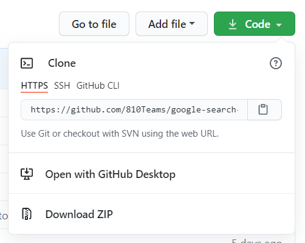

# Google Search Extractor Backend
Google search results extractor backend-side, using web scraping techniques, powered by Django and Django REST Framework.

## Getting Started
In this section, you will be guided in setting up the project and how to run it.

### Get Python
Download Python from [python.org](https://www.python.org/downloads/) or [anaconda.com](https://www.anaconda.com/products/individual).

### Get Libraries
Open up Command Prompt (Windows) or Terminal (MacOS or Linux), use the `cd` command to change the current directory to this project's directory, then type the following command, and hit the enter key.
```
pip install -r requirements.txt
```

If errors occur, or you simply wish to install each library by yourself. Type these commands in your Command Prompt or Terminal.
```
pip install django
pip install djangorestframework
pip install django-cors-headers
pip install django-crum
pip install django-cleanup
pip install requests_html
```

### Download Project
Click the green button labeled *Code*, the choose *Download ZIP*. After that, extract the ZIP file, and place the folder anywhere you wish.



### Setting Up Secret Key
Open `google_search_extractor/settings.py`, then scroll down to line 29, and you will see the variable named `SECRET_KEY`.
Set the value to a string of 50 characters in length, which can be a totally random string.

#### Example
```python
SECRET_KEY = '9$rv1t53_!go5gew)ypi(m1m5l0&sz)s!-hk6a13$*zg)*!ca_'
```

### Setting Up Database
This project is configured to use SQLite3, so if you wish to use any existing online databases, scroll down to line 96, then configure the variable `DATABASES`. This is totally optional configuration that can be skipped.

#### Example
```python
DATABASES = {
    'default': {
        'ENGINE': 'django.db.backends.mysql',
        'NAME': 'g_search_extract',
        'USER': 'root',
        'PASSWORD': '12345678',
        'HOST': '123.45.67.8',
        'PORT': '3306'
    }
}
```

### Making Migrations
The database is still fresh and new, which is not usable yet. Open up Command Prompt or Terminal, use the `cd` command to change the current directory to the project's directory, then type the following command and hit the *ENTER* key.

```
python manage.py makemigrations
```

### Migration
After it is done, migration files will be generated. Keep your Command Prompt or Terminal windows open, do not change the directory, then type the following command and hit the *ENTER* key.

```
python manage.py migrate
```

### Create Superuser
Django framework requires the superuser account in order to allow you to manage things, type the following command and hit the *ENTER* key.

```
python manage.py createsuperuser
```

Then follow the instructions instructed by the Django framework itself.

### Running
After downloading the necessary modules and performing the required setups, now the project is ready for usage.

To run the project, open up Command Prompt or Terminal, use the `cd` command to change the current directory to the project's directory, then type the following command and hit the *ENTER* key.

```
python manage.py runserver
```

### Stopping
To stop the project, simply press the `CTRL` and `C` key simultaneously in the Command Prompt or Terminal windows that is running the project.

## Pages
In this way, the project will be run in the localhost, which can be accessed via the browser by typing this URL.

```
http://127.0.0.1:8000/
```

### Admin Page
The Django admin is a system that allows staff and super users to manage the database, which can be accessed via this URL.

```
http://127.0.0.1:8000/admin
```

## API
The project is created in a structure of REST API services. For advanced or administrative uses, please use the admin page instead of APIs.

### User Application APIs
The user application contains a single model, the user model.

Use `GET /api/user/user` to list users.

Use `GET /api/user/user/<int>` to retrieve a single user by ID.

User `GET /api/user/login` to login. This will return a token that can be used in authentication when using other APIs.

### Extractor Application APIs
The extractor application contains 3 models, a scrape result, a scrape result page, and a scrape result item. All 3, including the user model, are related in a nested relationship, simply a tree data structure.

* A single user can own multiple scrape results.
* A single scrape result can contain multiple scrape result pages.
* A single scrape result page can contain multiple scrape result items.

Use `GET /api/extractor/scrape-result` to list scrape results, requires authentication, and only own results can be listed in this way.

Use `GET /api/extractor/scrape-result/<int>` to retrieve a single scrape result by ID, requires authentication, and only own results can be retrieved in this way.

Use `POST /api/extractor/scrape-result` to create a scrape result, requires authentication.

Use `DELETE /api/extractor/scrape-result/<int>` to delete a single scrape result by ID, requires authentication, and only down results can be deleted in this way.

Use `GET /api/extractor/scrape-result/page` to list scrape result pages, requires authentication, and only own results can be listed in this way.

Use `GET /api/extractor/scrape-result/page/<int>` to retrieve a single scrape result page by ID, requires authentication, and only own results can be retrieved in this way.

Use `GET /api/extractor/scrape-result/item` to list scrape result items, requires authentication, and only own results can be listed in this way.

Use `GET /api/extractor/scrape-result/item/<int>` to retrieve a single scrape result item by ID, requires authentication, and only own results can be retrieved in this way.

## Caution
Although generating scrape result pages is being executed in a separate thread and has 2 seconds (configurable) delay between each page, using `POST /api/extractor/scrape-result` with multiple keywords too many times may result in a response code of `429` from Google. If that occurs, stop using it, and wait for at least an hour before trying again.

## Members
||
|:--:|
|Teerapat Kraisrisirikul|
|[810Teams](https://github.com/810Teams)|


[](https://forthebadge.com)
[](https://forthebadge.com)
[](https://forthebadge.com)
[](https://forthebadge.com)
[](https://forthebadge.com)
